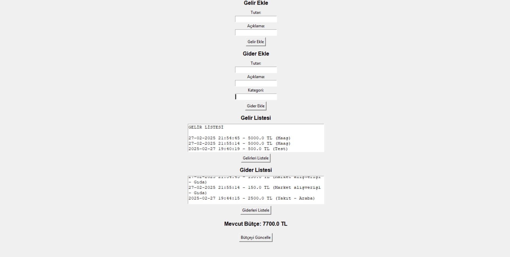

# Finans Takip Uygulaması

**Python & Tkinter ile geliştirilmiş bir Finans Takip Uygulaması!**

Bu uygulama gelir ve giderlerinizi takip etmenize, toplam bütçenizi hesaplamanıza ve geçmiş finansal kayıtlarınızı görüntülemenize olanak tanır.

---

## Özellikler
✅ **Gelir ekleyebilirsiniz.**  
✅ **Gider ekleyebilirsiniz.**  
✅ **Gelir ve giderlerinizi ayrı ayrı listeleyebilirsiniz.**  
✅ **Mevcut bütçenizi hesaplayıp gösterebilirsiniz.**  
✅ **Kullanıcı dostu GUI (Tkinter) ile kolay kullanım!**  

---

## Ekran Görüntüleri

**Ana Ekran:**



---

## Kurulum

### **1️⃣ Gereksinimler**
Bu projeyi çalıştırmadan önce aşağıdaki bağımlılıkları yüklemeniz gerekmektedir:
```bash
pip install tkinter
```

### **2️⃣ Projeyi Klonlayın**
```bash
git clone https://github.com/kullaniciadiniz/finans-takip.git
cd finans-takip
```

### **3️⃣ Uygulamayı Çalıştırın**
```bash
python gelir_gider.py
```

---

## 📜 Lisans
Bu proje **MIT Lisansı** altında yayınlanmıştır. Özgürce kullanabilirsiniz! 🎉

---


